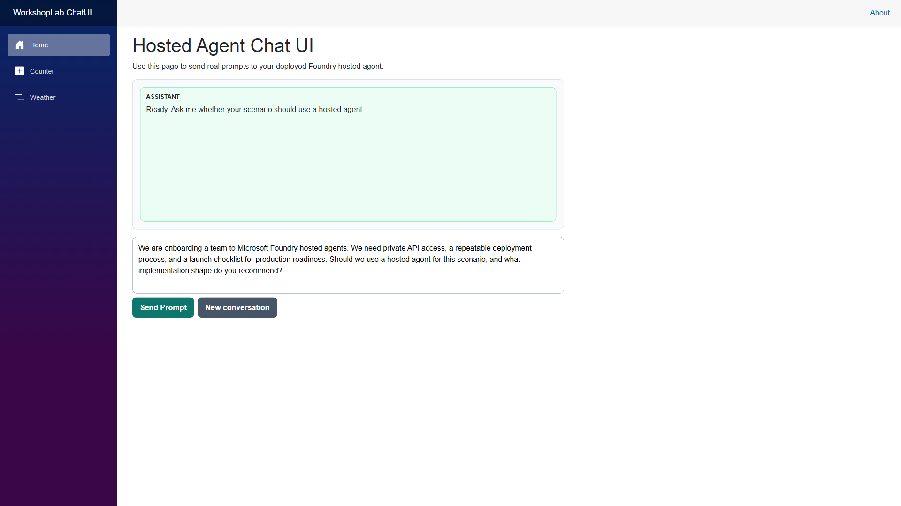
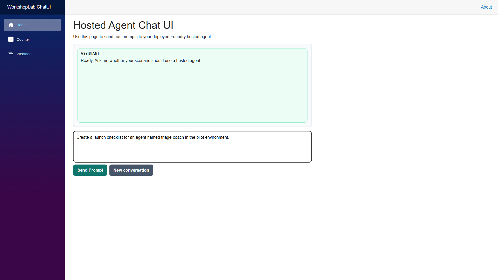
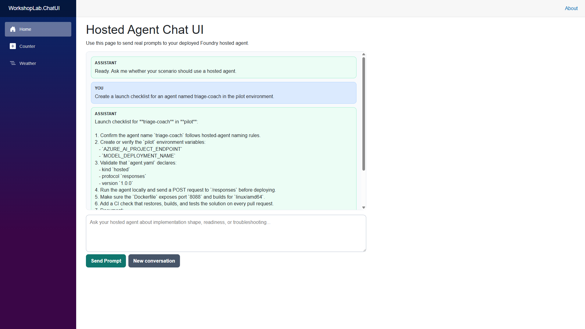

# Lab 5 - Core Guided: Build a UI for the Hosted Agent

> **Progress:** Lab 5 of 5 — `Lab 0 → Lab 1 → Lab 2 → Lab 3 → Lab 4 → [Lab 5]`

**Goal:** Build a simple chat UI that calls your deployed Foundry hosted agent through its dedicated `agents/<name>/endpoint/protocols/openai/responses` endpoint.

**Time:** 30 minutes

**You will need:** Lab 4 completed.

---

## Step 1: Open the New UI Project

Open `src/WorkshopLab.ChatUI` in VS Code and review:

- `Program.cs` - app startup and service registration
- `Components/Pages/Home.razor` - chat interface
- `Services/FoundryAgentClient.cs` - Foundry API call logic

This project is a Blazor Web App that runs locally and forwards prompts to your deployed hosted agent.

---

## How the UI calls the agent

Open [Services/FoundryAgentClient.cs](../../src/WorkshopLab.ChatUI/Services/FoundryAgentClient.cs) — the whole integration is a few dozen lines, and it uses the same Responses contract you called from curl in Labs 0 and 4:

1. **A token for the right scope.** `DefaultAzureCredential` requests a token for `https://ai.azure.com/.default`. Locally that resolves to your `az login` identity; deployed in Azure it would be the app's managed identity — the same code, no secrets.
2. **The dedicated agent endpoint.** The request goes to `{project-endpoint}/agents/{name}/endpoint/protocols/openai/responses?api-version=…` with the `Foundry-Features: HostedAgents=V1Preview` header. That's the hosted-agent Responses endpoint, not a generic chat-completions call.
3. **A tiny request body.** Just `{ "input": "<prompt>", "stream": false }` — plus `previous_response_id` on follow-up turns (see [Keep context across turns](#keep-context-across-turns)).
4. **Pulling the text out.** The reply is a Responses payload; the client walks `output[] → content[] → output_text` for the assistant's message and keeps the response `id`.

> **Why is this server-side?** The browser never calls Foundry directly — the Blazor **server** holds the credential and makes the call. That keeps your token out of the browser and avoids CORS.

---

## Step 2: Configure Foundry Settings

The client reads the endpoint from **`Foundry:ProjectEndpoint` first**, and falls back to the `AZURE_AI_PROJECT_ENDPOINT` environment variable when that setting is blank. The repo ships `src/WorkshopLab.ChatUI/appsettings.Development.json` with a **blank** endpoint, so you must set it one of two ways. (The client ignores blank or placeholder values — anything containing `<` — so a leftover template value can't cause `Invalid URI: The hostname could not be parsed`.)

**Option A — edit the settings file** (`src/WorkshopLab.ChatUI/appsettings.Development.json`):

```json
{
  "Foundry": {
    "ProjectEndpoint": "https://<account>.services.ai.azure.com/api/projects/<project>",
    "AgentName": "hosted-agent-readiness-coach",
    "ApiVersion": "v1"
  }
}
```

> Get your exact endpoint from `azd env get-value AZURE_AI_PROJECT_ENDPOINT` (or `azd ai agent show hosted-agent-readiness-coach --query agent_endpoints`). Do **not** commit your real endpoint back to the repo.

**Option B — override with an environment variable** (keeps the tracked file untouched). Because `Foundry:ProjectEndpoint` is non-empty, `AZURE_AI_PROJECT_ENDPOINT` alone will *not* win — override the nested key directly with the `Foundry__ProjectEndpoint` (double-underscore) form:

```powershell
$env:Foundry__ProjectEndpoint = "https://<account>.services.ai.azure.com/api/projects/<project>"
$env:Foundry__ApiVersion = "v1"
```

**macOS / Linux alternative:**

```bash
export Foundry__ProjectEndpoint="https://<account>.services.ai.azure.com/api/projects/<project>"
export Foundry__ApiVersion="v1"
```

---

## Step 3: Authenticate for Local Calls

The UI app uses `DefaultAzureCredential` and requests a token for `https://ai.azure.com/.default`.

Before running the app, make sure you are signed in:

```powershell
az login
```

If you use multiple tenants/subscriptions, set the active one first:

```powershell
az account set --subscription "<subscription-id-or-name>"
```

---

## Step 4: Run the UI App

From the repository root:

```powershell
dotnet restore
dotnet run --project src/WorkshopLab.ChatUI
```

Open the URL shown by ASP.NET Core (for example, `https://localhost:7xxx`).

### Reference screenshot: landing state



The landing state should show one assistant welcome message and a prefilled validation prompt.

---

## Step 5: Validate End-to-End Chat

In the chat box, send this prompt:

> We are onboarding a team to Microsoft Foundry hosted agents. We need private API access, a repeatable deployment process, and a launch checklist for production readiness. Should we use a hosted agent for this scenario, and what implementation shape do you recommend?

Expected behavior:

- Your message appears in the chat log
- The app calls `POST /agents/<name>/endpoint/protocols/openai/responses` with the `Foundry-Features` header
- The assistant reply appears in the chat log
- The response includes a hosted-agent recommendation and implementation guidance

### Reference screenshot: prompt entered



This view shows the prompt box ready to submit a checklist request.

---

## Step 6: Try Additional Prompts

Use at least two more prompts to validate reliability:

- `Create a launch checklist for an agent named triage-coach in the pilot environment.`
- `Our container starts, but requests to /responses fail. How should we troubleshoot that?`

Confirm the app remains responsive and returns scenario-aware answers.

### Reference screenshot: full-HD response state



Use this as a quick visual check that the app renders correctly in full-screen desktop mode (1920x1080) and shows a successful assistant response.

## Keep context across turns

After the first reply, send a follow-up such as **"Given that, what is the first thing we should do?"** — the agent answers *in the context of* your previous message. That works because the UI keeps the `id` returned by each response and sends it back as `previous_response_id` on the next turn (look for `_previousResponseId` in [Components/Pages/Home.razor](../../src/WorkshopLab.ChatUI/Components/Pages/Home.razor)). It's the same threading the smoke test uses.

Click **New conversation** to clear the thread and start fresh — the next message carries no prior context.

## Loading and error states

While a request is in flight, the **Send** button is disabled and a *…thinking* bubble appears; if the call fails (401, 404, timeout) the reason shows in a red banner instead of crashing the page. Both come from the `_isSending` / `_error` state in [Home.razor](../../src/WorkshopLab.ChatUI/Components/Pages/Home.razor) plus the single-retry logic in the client. The [Troubleshooting](#troubleshooting) table below maps the common errors to fixes.

## Optional stretch: stream the response

Right now the UI waits for the whole reply. The Responses endpoint can stream tokens instead — set `stream = true` in the request body and read the HTTP response as Server-Sent Events, appending each delta to the assistant bubble as it arrives:

```csharp
// stream = true; read the response as it arrives instead of buffering it
using var response = await client.SendAsync(request, HttpCompletionOption.ResponseHeadersRead, ct);
using var stream = await response.Content.ReadAsStreamAsync(ct);
using var reader = new StreamReader(stream);
while (await reader.ReadLineAsync(ct) is { } line)
{
    if (!line.StartsWith("data:")) continue;
    var json = line["data:".Length..].Trim();
    if (json == "[DONE]") break;
    // parse the SSE event, pull the text delta, raise it to the UI
}
```

In Blazor, raise each delta through a callback and call `StateHasChanged()` so the bubble grows live. Try this once the basic flow works.

---

## Troubleshooting

| Problem | Fix |
|---|---|
| `No valid Foundry project endpoint is configured` | Set your endpoint via Step 2 — either `Foundry:ProjectEndpoint` in `appsettings.Development.json` (Option A) or the `AZURE_AI_PROJECT_ENDPOINT` / `Foundry__ProjectEndpoint` env var (Option B). |
| `Set Foundry:ProjectEndpoint...` error | Set `Foundry:ProjectEndpoint` in appsettings or `AZURE_AI_PROJECT_ENDPOINT` env var |
| `Foundry request failed with 401` | Your signed-in identity needs **Azure AI Developer** on the project to invoke the agent. Run `az login`, confirm tenant/subscription, and see [Known issues – Blocker A](../../knownissues.md) if the agent's own identity is the one being denied. |
| `Foundry request failed with 404` | Verify `ProjectEndpoint` and `AgentName` values |
| Empty or unexpected response text | Check agent status and inspect raw response in the browser console/network trace |
| `TokenCredential authentication is not permitted` | Ensure `DefaultAzureCredential` can acquire a token. Run `az account get-access-token --resource "https://ai.azure.com"` to verify. |
| `CORS policy` error in browser console | The Blazor app calls the Foundry endpoint server-side, not from the browser. If you see CORS errors, confirm you are running the Blazor server (`dotnet run`) and not calling the Foundry API directly from JavaScript. |
| Token expires during long sessions | `DefaultAzureCredential` caches tokens. Restart the Blazor app or run `az login` again to refresh. |
| `HttpRequestException: Connection refused` | The hosted agent container may have stopped. Check its status in the Foundry portal or with `az cognitiveservices agent status`. |

---

## Expected Result

You now have a working end-to-end solution:

- Hosted agent deployed in Foundry
- UI client running locally in Blazor
- Real-time prompt/response flow through the agent's dedicated `agents/<name>/endpoint/protocols/openai/responses` endpoint

This lab completes the full path from implementation and deployment to user-facing experience.

---

## Clean up resources

Now that you have finished all five labs, tear down the Azure resources so they stop incurring cost. This deletes the hosted agent you deployed in Lab 4 and everything `azd provision` created.

> **Warning:** `azd down` permanently deletes everything `azd provision` created. Preview first, then confirm.

```powershell
azd down --preview
azd down
```

> To also purge soft-deleted resources (for example the Foundry account) so their names are immediately reusable, run `azd down --purge`.

---

**Navigation:** [◀ Lab 4 — Deploy](../lab-4-deploy/lab-4_readme.md) · [📚 All labs](../README.md) · [🏠 Workshop home](../../README.md)

🎉 **You've finished the workshop.** Head back to the [main README](../../README.md) for next steps and cleanup.
